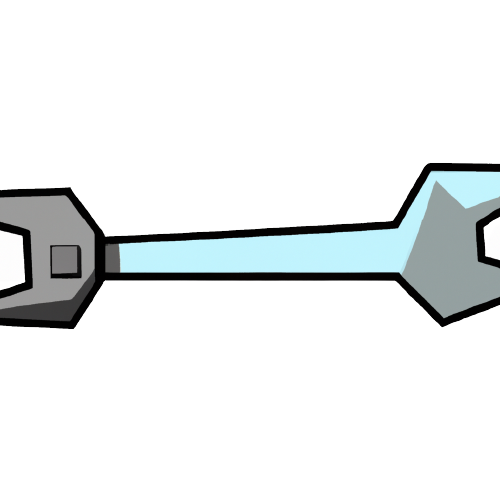

# MPM



## Quick Start

Edit the mpm.conf
- Add the path to your dir where you have you projects at.
- Add your github username
- Add your github token

And your done.

## How to use

```console
$ ./build.sh

$ ./mpm "your project name"
-> makes a dir with a local and remote repo that is public

$ ./mpm "your project name" -p
-> makes a dir with a local and remote repo that is private
```
